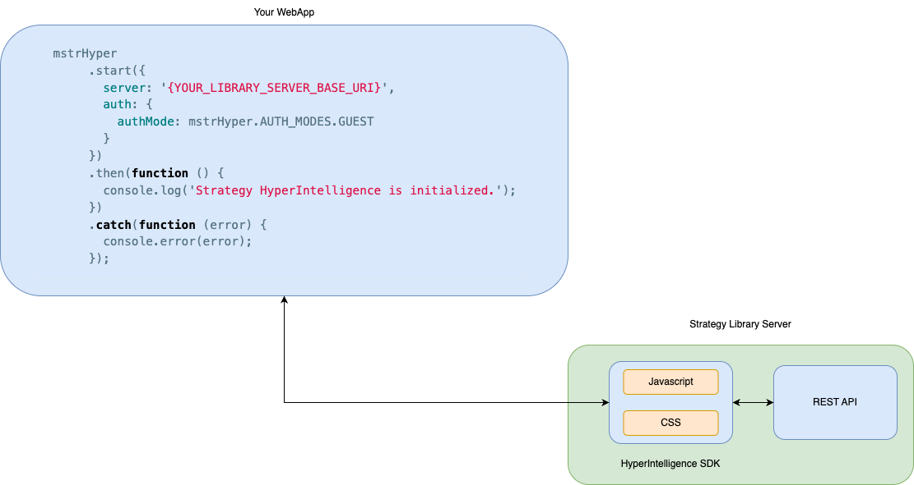

# MicroStrategy Hyper SDK

- [System Requirements](system-requirements.md)
- [Configuration and Customization](config)
  * [Initialize Hyper SDK](config/README.md#initialize-hyper-sdk)
  * [Authentication Configurations](config/README.md#authentication-configurations)
  * [Enable and Disable Cards](config/README.md#enable-and-disable-cards)
  * [Search](config/README.md#search)
  * [Highlight Settings](config/README.md#highlight-settings)
  * [Error Handling](config/README.md#error-handling)
- [Application Integration Samples](samples)
  * [Integrate Hyper SDK to a website](samples#integrate-hyperIntelligence-sdk-to-a-website)
  * [Integrate Hyper SDK to Sharepoint pages](samples#integrate-hyperIntelligence-sdk-to-sharepoint-pages)
  * [Integrate Hyper SDK to Salesforce pages](samples#integrate-hyperIntelligence-sdk-to-salesforce-pages)
  * [Working together with MicroStrategy Embedding SDK](samples#working-together-with-microStrategy-embedding-sdk)
  * [Integrate Hyper SDK to MicroStrategy Web via a plugin](samples#integrate-hyperIntelligence-sdk-to-microstrategy-web-via-a-plugin)
- [Frequently Asked Questions](faq.md)
- [API Doc](api.md)
- [Code Examples](https://microstrategy.github.io/hyper-sdk/code-examples/)
- [Feature Showcase](features.md)
## Introduction to HyperIntelligence

[HyperIntelligence](https://www.microstrategy.com/en/hyperintelligence) was introduced in MicroStrategy 2019 as a new addition to MicroStrategy Workstation and allows analysts to create objects called Cards.

Cards are visual representations of your data. In a card, you can create lists, matrix grids, ring charts, or text boxes to display your data in a quick and concise manner. By using an attribute from your data to serve as the keyword attribute, that attribute will then identify the elements that will trigger a card to appear.

After creating cards in Workstation, analysts can deploy their cards to a user's web browser, mobile device, and Microsoft Outlook. Users can then get real-time answers by hovering over keywords in a web browser, scanning a barcode on a mobile device, or clicking on an email to see relevant cards.

## What is Hyper SDK

Hyper SDK is a JavaScript SDK that allows you to quickly add [HyperIntelligence](https://www.microstrategy.com/en/hyperintelligence) to your own websites. Most HyperIntelligence features are supported in the SDK, such as finding and highlighting keywords on web pages, showing Hyper Cards when hovering a highlighted keyword, and the ability to copy &amp; share cards.

The Hyper SDK is comprised of a few JavaScript and stylesheet files, as well as a handful of images and fonts.

To enable HyperIntelligence with the SDK on your web page, 
you will need to configure Hyper SDK to connect to a HyperIntelligence Service instance where Hyper SDK is hosted in order to consume HyperIntelligence Cards.

Upon calling `start()` function, it will proceed to scan and highlight matched DOM elements on the web page.

