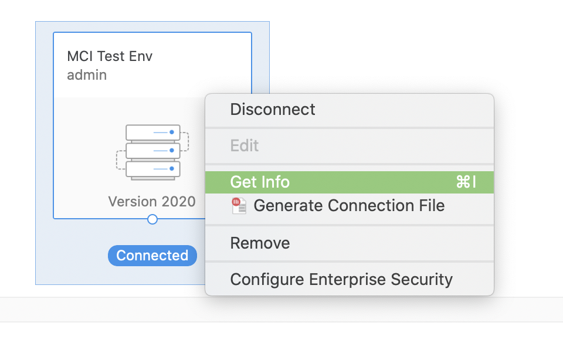
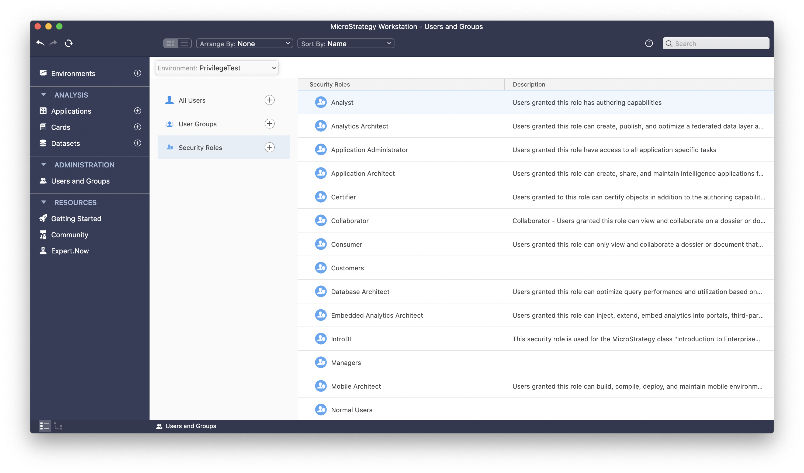
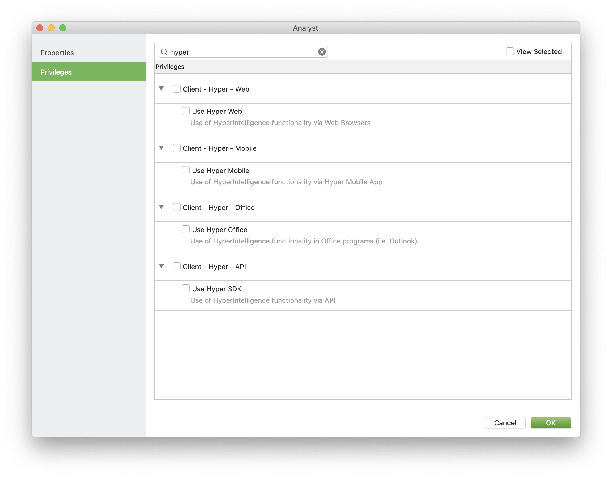

# Frequently Asked Questions

- `Q`: Does HyperSDK work in child iframes?
- `A`: Yes, you can set `highlightIframes` to ***true***.
  For more details please refer to [API Doc](api.md#mstrHyper).

---

- `Q`: Why does the SDK throw the error: "lack of privilege"?
- `A`: To be able to use HyperSDK, you must have the `Use Hyper SDK` privilege.
  *Where to find the settings to control privileges:*
  - Install and open [MicroStrategy Workstation](https://www2.microstrategy.com/producthelp/current/Workstation/WebHelp/Lang_1033/Content/home_workstation.htm)
  - Connect and Select your environment -> Right Menu
    
  - Select the [Security Roles](https://www2.microstrategy.com/producthelp/current/Workstation/WebHelp/Lang_1033/Content/create_security_roles.htm)
    
  - Make sure `Use Hyper SDK` is enabled for the corresponding security role
    

