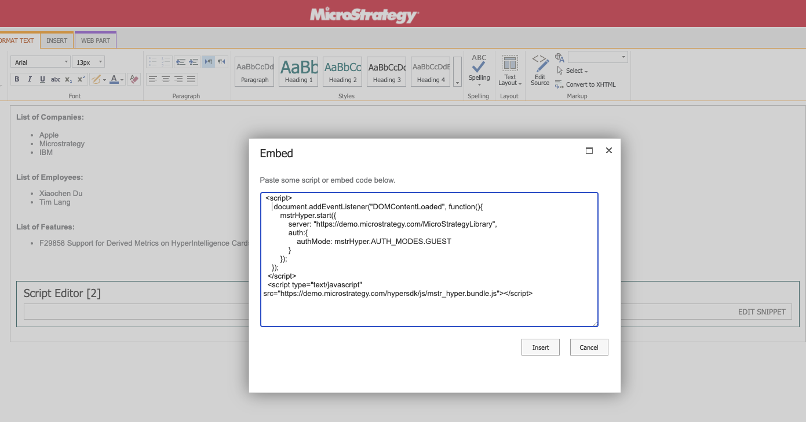
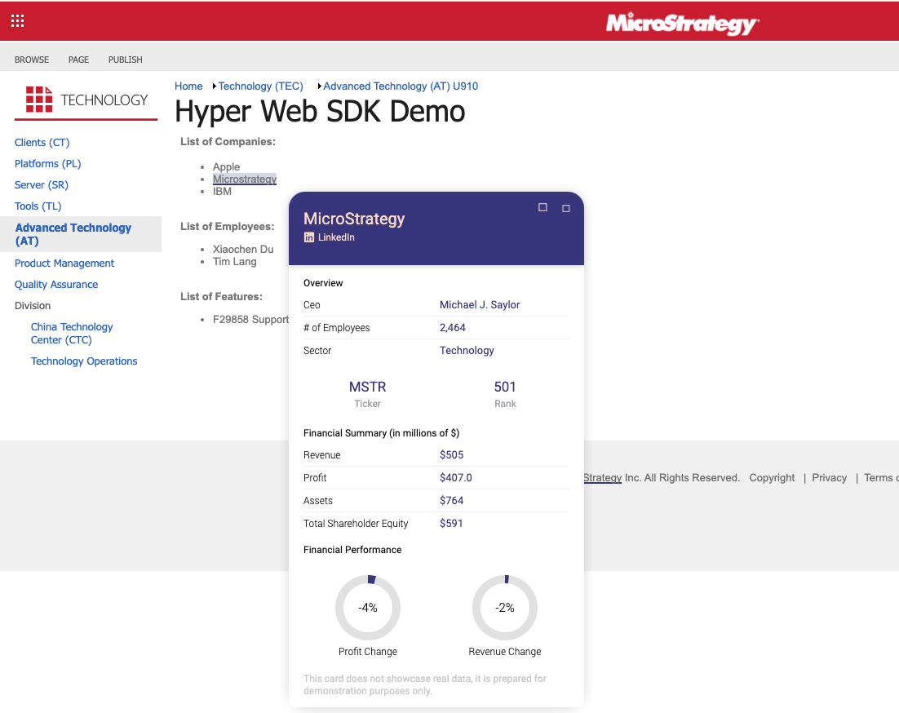
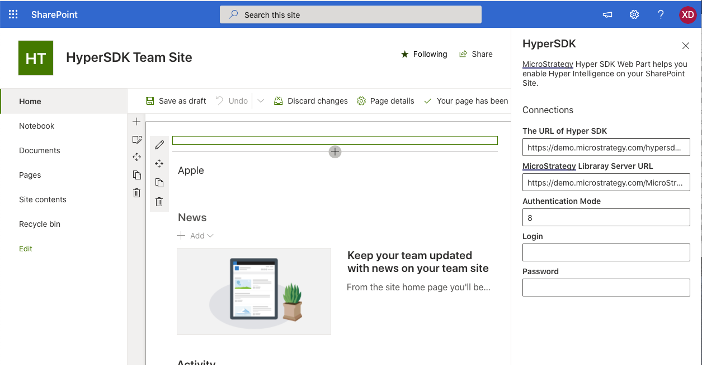
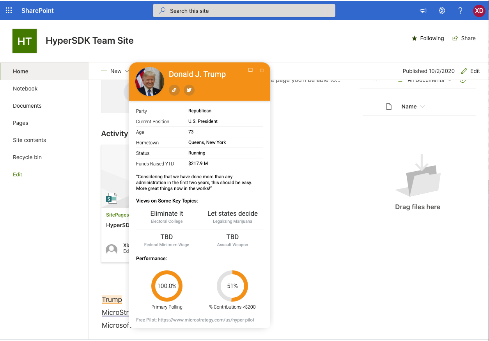

# Application Integration Samples

  * [Integrate HyperIntelligence SDK to a website](#integrate-hyperIntelligence-sdk-to-a-website)
  * [Integrate HyperIntelligence SDK to Sharepoint pages](#integrate-hyperIntelligence-sdk-to-sharepoint-pages)
  * [Integrate HyperIntelligence SDK to Salesforce pages](#integrate-hyperIntelligence-sdk-to-salesforce-pages)
  * [Working together with MicroStrategy Embedding SDK](#working-together-with-microStrategy-embedding-sdk)
  * [Integrate HyperIntelligence SDK to MicroStrategy Web via a plugin](#integrate-hyperIntelligence-sdk-to-microstrategy-web-via-a-plugin)

## Integrate HyperIntelligence SDK to a website

HyperIntelligence SDK can be integrated to any website so that users can interact with HyperIntelligence cards. In order to integrate HyperIntelligence SDK to a website, the following instructions should be followed.

### 1. Load HyperIntelligence SDK on your web pages
```html
<script type="text/javascript" 
src="https://demo.microstrategy.com/MicroStrategyLibrary/static/hyper/sdk/js/mstr_hyper.bundle.js">
</script>
```
>Please replace Library server url with your MCI instance url.
e.g. *https://mci-xxx.hypernow.microstrategy.com/MicroStrategyLibrary*

When you have the URL to HyperIntelligence SDK, determine the URL to the main JavaScript bundle file.

> You can get the URL to the main JavaScript bundle by appending `/js/mstr_hyper.bundle.js` to the URL of HyperIntelligence SDK. E.g. if the URL to your copy of HyperIntelligence SDK is https://mci-xxx.hypernow.microstrategy.com/MicroStrategyLibrary/static/hyper/sdk, the URL to the main JavaScript bundle is https://mci-xxx.hypernow.microstrategy.com/MicroStrategyLibrary/static/hyper/sdk/js/mstr_hyper.bundle.js

### 2. Initialize HyperIntelligence SDK

HyperIntelligence SDK needs to connect to a MicroStrategy Library Server to work. After HyperIntelligence SDK is added to your web page, initialize HyperIntelligence SDK by calling mstrHyper.start function like the following code snippet:

```html
<script>
  window.addEventListener('DOMContentLoaded', function () {
    mstrHyper
      .start({
        server: 'https://demo.microstrategy.co/MicroStrategyLibrary',
        auth: {
          authMode: mstrHyper.AUTH_MODES.GUEST
        }
      })
      .then(function () {
        console.log('MicroStrategy HyperIntelligence is initialized.');
      })
      .catch(function (error) {
        console.error(error);
      });
  });
</script>
```

### Working together with  MicroStrategy Embedding SDK
A typical usecase of HyperIntelligence SDK is to work together with [Embedding SDK](https://lw.microstrategy.com/msdz/MSDL/GARelease_Current/docs/projects/EmbeddingSDK/Content/topics/Intro_to_the_Embedding_SDK.htm), here's an example of the code:

``` html
<!DOCTYPE html>
<html>

<head>
  <title>HyperIntelligence SDK Demo</title>
</head>

<body>
    <div id='dossierContainer'>
    </div>

    <script>
      let SERVER_URL = 'YOUR SERVER URL';
      const projectId = 'B7CA92F04B9FAE8D941C3E9B7E0CD754';
      const dossierId = '9940B88041375A4E0407B6819B317601';

      function showDossier(authToken) {
        let placeHolderDiv = document.getElementById("dossierContainer");
        let dossierUrl = SERVER_URL +'/app/'+ projectId + '/' + dossierId;
        return microstrategy.dossier.create({
          placeholder: placeHolderDiv,
          url: dossierUrl,
          enableCustomAuthentication: true,
          enableResponsive: true,
          customAuthenticationType: microstrategy.dossier.CustomAuthenticationType.AUTH_TOKEN,
          getLoginToken: async () => authToken, //!!! getLoginToken should return promise
          navigationBar: {
            enabled: true
          },
        });
      }

      
      async function startAll(){
        await mstrHyper.init({
          server: SERVER_URL
        })
        authToken = await mstrHyper.login({
          authMode: mstrHyper.AUTH_MODES.GUEST, 
        });

        await showDossier(authToken);  
        
        await mstrHyper.enableCards([
          {
            "id":"30BE6FA64751626261539CA7E0BE1CB1",
            projectId
          }]);
      }

      window.onload = () => startAll();
    </script>
    <script type="text/javascript" src="https://demo.microstrategy.com/MicroStrategyLibrary/static/hyper/sdk/js/mstr_hyper.bundle.js"></script>
    <script type="text/javascript" src="https://demo.microstrategy.com/MicroStrategyLibrary/javascript/embeddinglib.js"></script>
</body>

</html>
```


## Integrate HyperIntelligence SDK to Sharepoint pages
[Microsoft SharePoint](https://www.microsoft.com/en-us/microsoft-365/sharepoint/collaboration) allows users to create websites with the use of multiple templates and SharePoint web parts, which incredibly expand the basic functionality.
>For more details please refer to [SharePoint Documentation](https://docs.microsoft.com/en-us/sharepoint/dev/spfx/web-parts/overview-client-side-web-parts).
>For code examples please refer to [SharePoint Framework Client-Side Web Part Samples & Tutorial Materials
](https://github.com/pnp/sp-dev-fx-webparts)

<figure class="video_container" >
  <video controls="true" allowfullscreen="true" width="800px">
    <source src="../img/SharePoint.mp4" type="video/mp4">
  </video>
</figure>

#### SharePoint Online Web Parts
To integrate with HyperIntelligence SDK on your SharePoint sites, you can build Web Parts to support it.

##### Classic Sites

You can use HyperSDK on SharePoint classic sites, using the out-of-the-box Script Editor web part. 

> If you don't see this option, please ask your admin to enable it.

  

Edit the Snippet of the web part, and add the follow code there.

```html
<script>
  document.addEventListener("DOMContentLoaded", function(){
    mstrHyper.start({
      server: "https://demo.microstrategy.com/MicroStrategyLibrary",
      mstrHyper.AUTH_MODES.GUEST,
    });
  });
</script>
<script
  type="text/javascript"
  src="https://demo.microstrategy.com/hypersdk/js/mstr_hyper.bundle.js">
</script>
```

 

 



##### Modern Sites
On a modern site you cannot edit code snippet in editor directly. Instead, you will be creating a Web Part bundle and upload to use it.

[Microsoft SharePoint](https://www.microsoft.com/en-us/microsoft-365/sharepoint/collaboration) allows users to create  websites with the use of multiple templates and SharePoint web parts, which incredibly expands the basic functionality.
>For more details please refer to [SharePoint Documentation](https://docs.microsoft.com/en-us/sharepoint/dev/spfx/web-parts/overview-client-side-web-parts).

>For code examples please refer to [SharePoint Framework Client-Side Web Part Samples & Tutorial Materials
](https://github.com/pnp/sp-dev-fx-webparts)

You can make your own web parts using HyperIntelligence SDK. 

  

  

Please refer to 
[Build & deploy your first web part](https://docs.microsoft.com/en-us/sharepoint/dev/spfx/web-parts/get-started/build-a-hello-world-web-part) for how to create web part. 

Here's an example you can follow to customize the configuration of HyperSDK:
[webpart.ts](webpart.ts)


## Integrate HyperIntelligence SDK to Salesforce pages

Salesforce provides a framework called [Visualforce](https://developer.salesforce.com/docs/atlas.en-us.pages.meta/pages/pages_intro_what_is_it.htm#:~:text=Visualforce%20is%20a%20framework%20that,natively%20on%20the%20Lightning%20platform). User can use visualforce makeup language to create custom pages using html and javascript as well as salesforce’s custom tags which can be hosted natively on the Lightning platform.


### How to use HyperSDK in Salesforce Visualforce page. 

Salesforce has a framework called Visualforce. User can use Visualforce makeup language to create custom pages using HTML and JavaScript as well as Salesforce’s custom tags.

More info on [Visualforce](https://developer.salesforce.com/docs/atlas.en-us.pages.meta/pages/pages_intro_what_is_it.htm#:~:text=Visualforce%20is%20a%20framework%20that,natively%20on%20the%20Lightning%20platform).


Here is the code you can used to create Visualforce component.

```html
<script
  type="text/javascript"
  src="https://demo.microstrategy.com/hypersdk/js/mstr_hyper.bundle.js">
</script>
<script>
  document.addEventListener("DOMContentLoaded", function(){
    mstrHyper.start({
      server: "https://demo.microstrategy.com/MicroStrategyLibrary",
      mstrHyper.AUTH_MODES.GUEST,
    });
  });
</script>
```


<figure class="video_container" >
  <video controls="true" allowfullscreen="true" width="800px">
    <source src="../img/VisualForce.mp4" type="video/mp4">
  </video>
</figure>

Then, you can use the component on Visualforce Page.

```xml
<apex:page >
    <c:hypersdk ></c:hypersdk>
    <apex:include pageName="UC"/>
    <apex:pageMessages />
</apex:page>
```

Visualforce has over 150 standard components. You can build custom component and custom pages. It works with all standard web tech (CSS, JavaScript, HTML).

Check out [Visualforce Developer Guide from Salesforce](https://developer.salesforce.com/docs/atlas.en-us.pages.meta/pages/pages_intro_what_is_it.htm#:~:text=Visualforce%20is%20a%20framework%20that,natively%20on%20the%20Lightning%20platform).


### Other ways to use HyperSDK

Please refer to [Salesforce Experience Builder](https://help.salesforce.com/articleView?id=community_designer_overview.htm&type=5) and [Salesforce Community](https://www.youtube.com/watch?v=mwdgueihnXA).

## Integrate HyperIntelligence SDK to MicroStrategy Web via a plugin

Some MicroStrategy Web customizations require the use of JavaScript to be included on a MicroStrategy Web page. The plug-in architecture provided by MicroStrategy Web can be used to achieve this purpose.
> Read more about [Adding Custom JavaScript](https://lw.microstrategy.com/msdz/MSDL/GARelease_Current/docs/projects/WebSDK/Content/topics/promptarch/PA_Adding_Custom_JavaScript.htm)

### Example of the HyperIntelligence SDK Custom Javascript
```js
(function() {
    // replace this line with the real sdk path
    const baseSDKFolder = 'https://mci-xxx.hypernow.microstrategy.com/MicroStrategyLibrary/static/hyper/sdk';

    // add initialization after page is done
    document.addEventListener("DOMContentLoaded", function() {
        // add script
        const script = document.createElement('script');
        script.src = baseSDKFolder + '/js/mstr_hyper.bundle.js';
        document.body.appendChild(script);

        script.onload = () => {
            mstrHyper.start({
                server: "https://mci-xxx.hypernow.microstrategy.com/MicroStrategyLibrary",
                auth: {
                    authMode: mstrHyper.AUTH_MODES.GUEST
                }
            });
        }
    });
}());
```

#### How to deploy the HyperIntelligence SDK plugin on MicroStrategy Web?

1.	Connect to the application server where MicroStrategy Web is installed
2.	Navigate to the path for MicroStrategy Web
3.	Copy and paste the “HyperIntelligence SDK” folder in the “Plugins” folder under “MicroStrategy”.  
4.	Open and edit the “global.js” in “javascript” under the “HyperIntelligence SDK” folder just pasted.
5.	Restart the application server 

#### Example of Plugin File
[Sample MSTR Web Plugin](../samples/plugin.zip)

