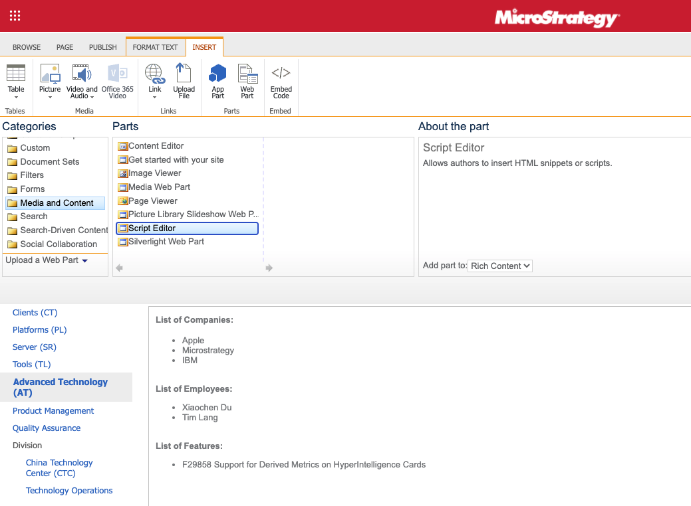

# Application Integration Samples

- [Application Integration Samples](#application-integration-samples)
  - [Integrate Hyper SDK to a website](#integrate-hyper-sdk-to-a-website)
    - [1. Load Hyper SDK on your web pages](#1-load-hyper-sdk-on-your-web-pages)
    - [2. Initialize the Hyper SDK](#2-initialize-the-hyper-sdk)
    - [Working together with MicroStrategy Embedding SDK](#working-together-with-microstrategy-embedding-sdk)
  - [Integrate Hyper SDK to Sharepoint pages](#integrate-hyper-sdk-to-sharepoint-pages)
    - [SharePoint Online Web Parts](#sharepoint-online-web-parts)
      - [Classic Sites](#classic-sites)
      - [Modern Sites](#modern-sites)
  - [Integrate Hyper SDK to Salesforce pages](#integrate-hyper-sdk-to-salesforce-pages)
    - [How to use HyperSDK in Salesforce Visualforce page](#how-to-use-hypersdk-in-salesforce-visualforce-page)
    - [Other ways to use HyperSDK](#other-ways-to-use-hypersdk)
  - [Integrate Hyper SDK to MicroStrategy Web via a plugin](#integrate-hyper-sdk-to-microstrategy-web-via-a-plugin)
    - [Example of the Hyper SDK Custom Javascript](#example-of-the-hyper-sdk-custom-javascript)
      - [How to deploy the Hyper SDK plugin on MicroStrategy Web?](#how-to-deploy-the-hyper-sdk-plugin-on-microstrategy-web)
      - [Example plugin](#example-plugin)
      - [Example plugin that supports seamless login](#example-plugin-that-supports-seamless-login)
  - [Integrate Hyper SDK to MicroStrategy Library Web via a plugin](#integrate-hyper-sdk-to-microstrategy-library-web-via-a-plugin)
    - [Example of the Hyper SDK Custom Javascript](#example-of-the-hyper-sdk-custom-javascript-1)
      - [How to deploy the Hyper SDK plugin on MicroStrategy Library Web?](#how-to-deploy-the-hyper-sdk-plugin-on-microstrategy-library-web)
      - [Example of Plugin File](#example-of-plugin-file)

## Integrate Hyper SDK to a website

Hyper SDK can be integrated to any website so that users can interact with HyperIntelligence cards. To integrate Hyper SDK to a website, follow the instructions below.

### 1. Load Hyper SDK on your web pages

```html
<script type="text/javascript"
src="{YOUR_LIBRARY_SERVER_BASE_URI}/static/hyper/sdk/js/mstr_hyper.bundle.js">
</script>
```

> Please replace `{YOUR_LIBRARY_SERVER_BASE_URI}` with your MCI Library Server instance url.
> e.g. *https://mci-xxx.hypernow.microstrategy.com/MicroStrategyLibrary*
>
> Regarding how to create a HyperIntelligence Service instance, please refer to [HyperIntelligence](https://www.microstrategy.com/en/hyperintelligence).
>
> Once you have the URL to the Library Server, you can get the URL to the Hyper SDK main JavaScript bundle by appending `/static/hyper/sdk/js/mstr_hyper.bundle.js` to the end. E.g. if your Library Server URL is `https://mci-xxx.hypernow.microstrategy.com/MicroStrategyLibrary`, the URL to the main JavaScript bundle is `https://mci-xxx.hypernow.microstrategy.com/MicroStrategyLibrary/static/hyper/sdk/js/mstr_hyper.bundle.js`

### 2. Initialize the Hyper SDK

Hyper SDK needs to connect to a MicroStrategy Library Server to work. After Hyper SDK is loaded to your web page, initialize Hyper SDK by calling `mstrHyper.start` function like below:

```html
<script>
  window.addEventListener('load', function () {
    mstrHyper
      .start({
        server: '{YOUR_LIBRARY_SERVER_BASE_URI}',
        auth: {
          authMode: mstrHyper.AUTH_MODES.GUEST
        }
      })
      .then(function () {
        console.log('MicroStrategy HyperIntelligence is initialized.');
      })
      .catch(function (error) {
        console.error(error);
      });
  });
</script>
```

### Working together with MicroStrategy Embedding SDK

A typical use case of Hyper SDK is to work together with [Embedding SDK](https://lw.microstrategy.com/msdz/MSDL/GARelease_Current/docs/projects/EmbeddingSDK/Content/topics/Intro_to_the_Embedding_SDK.htm), here's an example:

``` html
<!DOCTYPE html>
<html>
<head>
  <title>Hyper SDK Demo</title>
</head>
<body>
    <div id="dossierContainer"></div>
    <script>
      var SERVER_URL = '{YOUR_LIBRARY_SERVER_BASE_URI}';
      var projectId = 'B7CA92F04B9FAE8D941C3E9B7E0CD754';
      var dossierId = '9940B88041375A4E0407B6819B317601';

      function showDossier(authToken) {
        var placeHolderDiv = document.getElementById('dossierContainer');
        var dossierUrl = SERVER_URL +'/app/'+ projectId + '/' + dossierId;
        return microstrategy.dossier.create({
          placeholder: placeHolderDiv,
          url: dossierUrl,
          enableCustomAuthentication: true,
          enableResponsive: true,
          customAuthenticationType: microstrategy.dossier.CustomAuthenticationType.AUTH_TOKEN,
          getLoginToken: async () => authToken, // getLoginToken should return a promise
          navigationBar: {
            enabled: true
          },
        });
      }

      async function startAll(){
        await mstrHyper.init({ server: SERVER_URL });
        var authToken = await mstrHyper.login({
          authMode: mstrHyper.AUTH_MODES.GUEST,
        });

        await showDossier(authToken);
        await mstrHyper.enableCards([
          {
            "id":"30BE6FA64751626261539CA7E0BE1CB1",
            projectId
          }]);
      }

      window.onload = () => startAll();
    </script>
    <script type="text/javascript" src="{YOUR_LIBRARY_SERVER_BASE_URI}/static/hyper/sdk/js/mstr_hyper.bundle.js"></script>
    <script type="text/javascript" src="{YOUR_LIBRARY_SERVER_BASE_URI}/javascript/embeddinglib.js"></script>
</body>
</html>
```

## Integrate Hyper SDK to Sharepoint pages

[Microsoft SharePoint](https://www.microsoft.com/en-us/microsoft-365/sharepoint/collaboration) allows users to create websites with the use of multiple templates and SharePoint web parts, which incredibly expand the basic functionality.
> For more details please refer to [SharePoint Documentation](https://docs.microsoft.com/en-us/sharepoint/dev/spfx/web-parts/overview-client-side-web-parts).
> For code examples please refer to [SharePoint Framework Client-Side Web Part Samples & Tutorial Materials
](https://github.com/pnp/sp-dev-fx-webparts)

<figure class="video_container" >
  <video controls="true" allowfullscreen="true" width="800px">
    <source src="../img/SharePoint.mp4" type="video/mp4">
  </video>
</figure>

### SharePoint Online Web Parts

To integrate with Hyper SDK on your SharePoint sites, you can build Web Parts to support it.

#### Classic Sites

You can use HyperSDK on SharePoint classic sites, using the out-of-the-box Script Editor web part.

> If you don't see this option, please ask your admin to enable it.



Edit the Snippet of the web part, and add the follow code there.

```html
<script>
  const initHyperSDK = function() {
    mstrHyper.start({
      server: '{YOUR_LIBRARY_SERVER_BASE_URI}',
      auth: {
        authMode: mstrHyper.AUTH_MODES.GUEST
      }
    });
  }
  if(document.readyState === 'complete') {
    initHyperSDK();
  } else {
    window.addEventListener('load', initHyperSDK);
  }
</script>
<script
  type="text/javascript"
  src="{YOUR_LIBRARY_SERVER_BASE_URI}/static/hyper/sdk/js/mstr_hyper.bundle.js">
</script>
```


#### Modern Sites

On a modern site you cannot edit code snippet in editor directly. Instead, you will be creating a Web Part bundle and upload to use it.

[Microsoft SharePoint](https://www.microsoft.com/en-us/microsoft-365/sharepoint/collaboration) allows users to create  websites with the use of multiple templates and SharePoint web parts, which incredibly expands the basic functionality.
> For more details please refer to [SharePoint Documentation](https://docs.microsoft.com/en-us/sharepoint/dev/spfx/web-parts/overview-client-side-web-parts).
>
> For code examples please refer to [SharePoint Framework Client-Side Web Part Samples & Tutorial Materials
](https://github.com/pnp/sp-dev-fx-webparts)

You can make your own web parts using Hyper SDK.


Please refer to
[Build & deploy your first web part](https://docs.microsoft.com/en-us/sharepoint/dev/spfx/web-parts/get-started/build-a-hello-world-web-part) for how to create web part.

Here's an example you can follow to customize the configuration of HyperSDK:
[webpart.ts](webpart.ts)

## Integrate Hyper SDK to Salesforce pages

Salesforce provides a framework called [Visualforce](https://developer.salesforce.com/docs/atlas.en-us.pages.meta/pages/pages_intro_what_is_it.htm#:~:text=Visualforce%20is%20a%20framework%20that,natively%20on%20the%20Lightning%20platform). User can use visualforce makeup language to create custom pages using html and javascript as well as salesforce’s custom tags which can be hosted natively on the Lightning platform.

### How to use HyperSDK in Salesforce Visualforce page

Salesforce has a framework called Visualforce. User can use Visualforce makeup language to create custom pages using HTML and JavaScript as well as Salesforce’s custom tags.

More info on [Visualforce](https://developer.salesforce.com/docs/atlas.en-us.pages.meta/pages/pages_intro_what_is_it.htm#:~:text=Visualforce%20is%20a%20framework%20that,natively%20on%20the%20Lightning%20platform).

Here is the code you can used to create Visualforce component.

```html
<script
  type="text/javascript"
  src="{YOUR_LIBRARY_SERVER_BASE_URI}/static/hyper/sdk/js/mstr_hyper.bundle.js">
</script>
<script>
  const initHyperSDK = function() {
    mstrHyper.start({
      server: '{YOUR_LIBRARY_SERVER_BASE_URI}',
      mstrHyper.AUTH_MODES.GUEST,
    });
  }
  if(document.readyState === 'complete') {
    initHyperSDK();
  } else {
    window.addEventListener('load', initHyperSDK);
  }
</script>
```

<figure class="video_container" >
  <video controls="true" allowfullscreen="true" width="800px">
    <source src="../img/VisualForce.mp4" type="video/mp4">
  </video>
</figure>

Then, you can use the component on Visualforce Page.

```xml
<apex:page >
    <c:hypersdk ></c:hypersdk>
    <apex:include pageName="UC"/>
    <apex:pageMessages />
</apex:page>
```

Visualforce has over 150 standard components. You can build custom component and custom pages. It works with all standard web tech (CSS, JavaScript, HTML).

Check out [Visualforce Developer Guide from Salesforce](https://developer.salesforce.com/docs/atlas.en-us.pages.meta/pages/pages_intro_what_is_it.htm#:~:text=Visualforce%20is%20a%20framework%20that,natively%20on%20the%20Lightning%20platform).

### Other ways to use HyperSDK

Please refer to [Salesforce Experience Builder](https://help.salesforce.com/articleView?id=community_designer_overview.htm&type=5) and [Salesforce Community](https://www.youtube.com/watch?v=mwdgueihnXA).

## Integrate Hyper SDK to MicroStrategy Web via a plugin

Some MicroStrategy Web customizations require the use of JavaScript to be included on a MicroStrategy Web page. The plug-in architecture provided by MicroStrategy Web can be used to achieve this purpose.
> Read more about [Adding Custom JavaScript](https://lw.microstrategy.com/msdz/MSDL/GARelease_Current/docs/projects/WebSDK/Content/topics/promptarch/PA_Adding_Custom_JavaScript.htm)

### Example of the Hyper SDK Custom Javascript

```js
(function (config) {
  const PATH_TO_HYPER_JS = '/static/hyper/sdk/js/mstr_hyper.bundle.js';
  const joinUrl = (baseUrl, apiUrl) =>
    `${baseUrl.replace(/\/+$/g, '')}/${apiUrl.replace(/^\/+/g, '')}`;

  const initPlugin = () => {
    const script = document.createElement('script');
    script.src = joinUrl(config.libraryServerUrl, PATH_TO_HYPER_JS);
    document.body.appendChild(script);

    script.onload = () => {
      mstrHyper.start({
        server: config.libraryServerUrl,
        auth: {
          authMode: mstrHyper.AUTH_MODES.GUEST
        }
      });
    };
  };

  if (document.readyState === 'complete') {
    initPlugin();
  } else {
    window.addEventListener('load', initPlugin);
  }
})({
  libraryServerUrl: 'YOUR LIBRARY SERVER URL'
});
```

#### How to deploy the Hyper SDK plugin on MicroStrategy Web?

1. Connect to the application server where MicroStrategy Web is installed
2. Navigate to the path for MicroStrategy Web
3. Copy and paste the "Hyper-SDK" folder in the "Plugins" folder under "MicroStrategy".
4. Open and edit the "global.js" in "javascript" under the "Hyper-SDK" folder just pasted.
5. Restart the application server.

#### Example plugin

[Sample MSTR Web Plugin](../samples/dist/MSTRWeb-plugin.zip)

#### Example plugin that supports seamless login

[Sample MSTR Web Seamless Login Plugin](../samples/dist/MSTRWeb-plugin-seamless-login.zip)

## Integrate Hyper SDK to MicroStrategy Library Web via a plugin

The way plugin works in MicroStrategy Library Web is the same as MicroStrategy Web.
> Read more about [Adding Custom JavaScript](https://lw.microstrategy.com/msdz/MSDL/GARelease_Current/docs/projects/WebSDK/Content/topics/promptarch/PA_Adding_Custom_JavaScript.htm)

### Example of the Hyper SDK Custom Javascript

```js
(function (config) {
  const PATH_TO_HYPER_JS = '/static/hyper/sdk/js/mstr_hyper.bundle.js';
  const joinUrl = (baseUrl, apiUrl) =>
    `${baseUrl.replace(/\/+$/g, '')}/${apiUrl.replace(/^\/+/g, '')}`;

  const initPlugin = () => {
    const script = document.createElement('script');
    script.src = joinUrl(config.libraryServerUrl, PATH_TO_HYPER_JS);
    document.body.appendChild(script);

    script.onload = () => {
      mstrHyper.start({
        server: config.libraryServerUrl,
        auth: {
          authMode: mstrHyper.AUTH_MODES.GUEST
        }
      });
    };
  };

  if (document.readyState === 'complete') {
    initPlugin();
  } else {
    window.addEventListener('load', initPlugin);
  }
})({
  libraryServerUrl: 'YOUR LIBRARY SERVER URL'
});
```

#### How to deploy the Hyper SDK plugin on MicroStrategy Library Web?

1. Connect to the application server where MicroStrategy Library Web is installed.
2. Navigate to the path for MicroStrategy Library Web.
3. Copy and paste the "Hyper-SDK" folder in the "Plugins" folder under "MicroStrategyLibrary".
4. Open and edit the "global.js" in "javascript" under the "Hyper-SDK" folder just pasted.
5. Restart the application server.

#### Example of Plugin File

[Sample MSTR Library Web Plugin](../samples/dist/MSTRWeb-plugin.zip)
