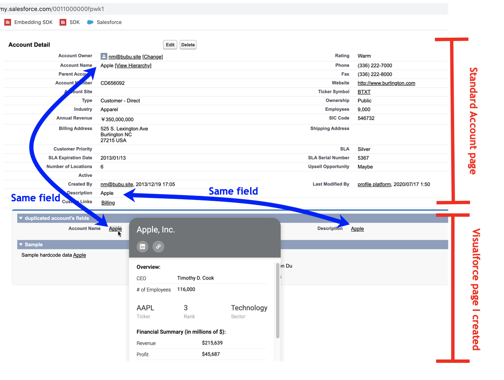

# Salesforce

## Can developer create custom pages on Salesforce using HTML and Javascript?

Yes. Salesforce has a framework called Visualforce. User can use visualforce makeup language to create custom pages using html and javascript as well as salesforce’s custom tags.

More info on [Visualforce](https://developer.salesforce.com/docs/atlas.en-us.pages.meta/pages/pages_intro_what_is_it.htm#:~:text=Visualforce%20is%20a%20framework%20that,natively%20on%20the%20Lightning%20platform).

Intro to Visualforce on Youtube: https://www.youtube.com/watch?v=nzvqDUtwdcY

https://help.salesforce.com/articleView?id=extend_click_intro.htm&type=5

## Other ways to customize page’s code?

Look into Salesforce [Experience Builder](https://help.salesforce.com/articleView?id=community_designer_overview.htm&type=5).

Look into Salesforce Community. https://www.youtube.com/watch?v=mwdgueihnXA

## How to enable Hyper SDK on Visual Force Page?

Here is the code I used to create VisualForce component.

```html
<script
  type="text/javascript"
  src="https://tutorial.microstrategy.com/hypersdk/js/mstr_hyper.bundle.js">
</script>
<script>
  document.addEventListener("DOMContentLoaded", function(){
    mstrHyper.start({
      server: "https://demo.microstrategy.com/MicroStrategyLibrary",
      authMode: 0x08,
      baseURI: "https://tutorial.microstrategy.com/hypersdk/"
    });
  });
</script>
```

The HyperSDK is hosted on tutorial.microstrategy.com.  The visualforce component can be added into visualforce page.

Then, you can use the component created on VisualForce Page.

```xml
<apex:page >
    <c:hypersdk ></c:hypersdk>
    <apex:include pageName="UC"/>
    <apex:pageMessages />
</apex:page>
```

VF has over 150 standard components. You can build custom components, and custom pages. It works with all standard web tech (CSS, JavaScript, HTML).

Checkout VisualForce Developer Guide from Salesforce’s [Visualforce](https://developer.salesforce.com/docs/atlas.en-us.pages.meta/pages/pages_intro_what_is_it.htm#:~:text=Visualforce%20is%20a%20framework%20that,natively%20on%20the%20Lightning%20platform).

You can also use Visual Force Page in another page. There are some limitations. The following page shows Hyper SDK is added into Visualforce Page, however, it doesn’t highlight the keyword outside the VF page. That is because salesforce implemented VF page using an iFrame, Hyper SDK is running inside the iFrame. Another limitation is the hyper card cannot be displayed outside the iframe border.



https://web.microsoftstream.com/embed/video/2c0522cb-851d-47d8-abf6-84bc6c56b5c2?autoplay=false&amp;showinfo=true
