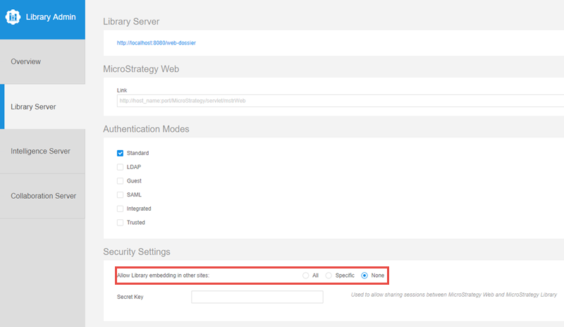

## Prerequisites for Using HyperIntelligence SDK

The following prerequisites must be met to use HyperIntelligence SDK.

### System Requirements
The HyperIntelligence SDK leverages [MicroStrategy REST API](https://lw.microstrategy.com/msdz/MSDL/GARelease_Current/docs/projects/RESTSDK/Content/topics/REST_API/REST_API.htm) and is currently hosted with MicroStrategy Library server instance. You will need to have your application integrated with the HyperIntelligence SDK and connected to a MicroStrategy Library server instance in order to consume HyperIntelligence Cards.

**Platform Version Support:**
- [MicroStrategy Platform Analytics](https://www2.microstrategy.com/producthelp/current/InstallConfig/en-us/Content/platform_analytics.htm) : MicroStrategy 2021 GA and above.

- [Hyper.Now](https://www.microstrategy.com/en/hyperintelligence): SaaS offering, always up to date.


### Supported Authentication

Currently, HyperIntelligence SDK supports:
- OIDC
- Guest
- Standard


## Browser Support

| **Browser**                 | **Supported Versions** |
| :-------------------------- | :--------------------- |
| Google Chrome               | v80.0+                 |
| Mozilla Firefox             | v79.0+                 |
| Apple Safari                | v12.0+                 |
| Microsoft Edge              | v80.0+                 |

## Other Prerequisites
### Enable Cross-Origin Resource Sharing (CORS)
```
Not required for Hyper.Now
```
Cross-Origin Resource Sharing (CORS) provides a way for a web application running in one origin (domain, protocol, and port) to access selected resources from a server in a different origin. A cross-origin HTTP request uses additional HTTP headers to tell the browser to let the web application share resources. For security reasons, browsers restrict cross-origin HTTP requests initiated from within scripts. This means that when a web application requests HTTP resources from a different origin, the response from the other origin must include the right CORS headers.

To enable CORS for the REST Server:

1. Open the Library Admin page. Your URL should be similar to the following:

    ```
    https://<host_name>:<port>/MicroStrategyLibrary/admin
    ```

2. Navigate to Library Server -> Security Settings.
3. Choose the appropriate setting for Allow Library embedding in other sites to reconfigure CORS.
  


Using the Library Admin page is the easiest way to enable CORS for the REST Server, but you can also configure CORS manually.
1. Navigate to `MicroStrategyLibrary/WEB-INF/classes/config/configOverride.properties`.
2. Edit the configOverride.properties file in a text editor.
3. Add the following lines, or replace them if already present:
    ```
    auth.cors.origins=http://example.com:port
    security.allowedOrigins=http://example.com:port
    ```

4. Restart your MicroStrategy Library web application hosted on the application server.

### SameSite
```
Not required for Hyper.Now
```
Chrome(version 80+) and Edge(version 86+) Web Browser introduce new changes which may impact embedding. 

For Hyper SDK to function as expected in a 3rd party context, it is required to explicitly label session cookies with `SameSite=None; Secure`. 

For more information, see [Chrome v80 Cookie Behavior and the Impact on MicroStrategy Deployments](https://community.microstrategy.com/s/article/Chrome-v80-Cookie-Behavior-and-the-impact-on-MicroStrategy-Deployments?language=en_US).
